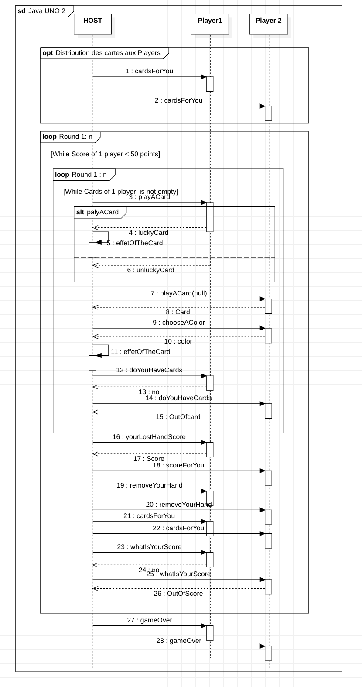

# Règles

Le jeu se joue à au moins deux joueurs et comporte un maitre du jeu non joueur.

## Mise en place

* Chaque joueur reçoit 7 cartes tirées aléatoirement, qu'il garde face cachée (sauf pour lui).

* La première carte du talon est prise depuis la pioche et ne dois pas être une carte spéciale.

* Tant que la première carte du talon est une carte spéciale, le host remet une carte dans le talon.

## Déroulé de la partie

Les joueurs sont répartis dans l'ordre d'arrivée. Chaque joueur pose une carte de la couleur et/ou du chiffre de la carte supérieur du talon, à tour de rôle. Si un joueur n'a plus de carte, il gagne la partie et ne peut plus joueur.

## Déroulé des tours
* Lors d'un tour, chacun des joueurs joue une carte de sa pile sauf si il y a une carte spéciale : la dernière carte posée est un +4, +2, passer ou inversion.

* Un joueur peut poser plusieurs carte en même temps, du moment qu'elles soit toutes de même valeur et que l'une d'elles ait la même couleur et/ou la même valeur que la carte supérieur du talon. A chaque erreur, il pioche deux carte.

* Si le joueur lui reste une seule carte, il dit automatiquement un "uno".

## Fin de la partie

Le gagnant est le premier qui n'a plus de cartes dans la main.

## Détail des Cartes

108 cartes réparties de la façon suivante :

* 19 cartes bleues, numérotées entre 0 et 9.
* 19 cartes rouges, numérotées entre 0 et 9.
* 19 cartes jaunes, numérotées entre 0 et 9.
* 19 cartes vertes, numérotées entre 0 et 9.
* 8 cartes "+2", (2 de chaque couleur).
* 4 cartes "JOKER".
* 4 cartes "+4".
* 2 cartes “INVERSION” par couleur.
* 2 cartes ”PASSER” par couleur.

Les cartes spéciaux :

* "+2" : Lorsque cette carte est jouée, dans tous les cas le joueur suivant doit tirer 2 cartes dans la pioche et passe son tour. Idem si c’est la première carte du talon. Une telle carte ne peut être jouée que sur une carte de la même couleur ou sur une autre carte "+2".

* "JOKER" (4 couleurs) : Le joueur qui dépose cette carte peut choisir de changer la couleur (il annoncera son choix en jouant la carte) ou de continuer dans la couleur demandée, peu importe le numéro. Si c’est la première carte du talon, on prend une nouvelle carte . Une telle carte peut être jouée après n’importe quelle autre carte.

* "+4" : C’est une carte bien particulière : elle permet de pénaliser le joueur suivant tout en remplissant les fonctions de Joker. Lorsque cette carte est jouée, le joueur suivant doit tirer 4 cartes dans la pioche .

* “INVERSION” : Cette carte entraîne l’inversion du sens du jeu. Si le jeu se déroulait vers la droite, il doit désormais se dérouler vers la gauche et inversement. Ainsi si le joueur pose deux cartes “INVERSION”, le sens ne change pas.

* ”PASSER” : Cette carte impose au joueur suivant de passer son tour. Elle ne peut être jouée que sur une carte de la même couleur ou bien sur une autre carte “PASSER”.

## Détail des classes principales

Un exemple de jeu supportant le réseau

* LocalUnoGame la version du jeu supportant le jeu en local
* UnoGameEngine le moteur du jeu
* UnoGameNetorkPlayer le joueur distant en cas de partie réseau
* UnoGameNetworkEngine la version du jeu supportant le réseau

## Protocole réseau

> Le protocole réseau définit les séquences des commandes échangées entre les différentes parties prenantes. Il doit contenir, pour chaque commande, l'expéditeur, le destinataire, le nom de la commande et le contenu du corps de la commande.

